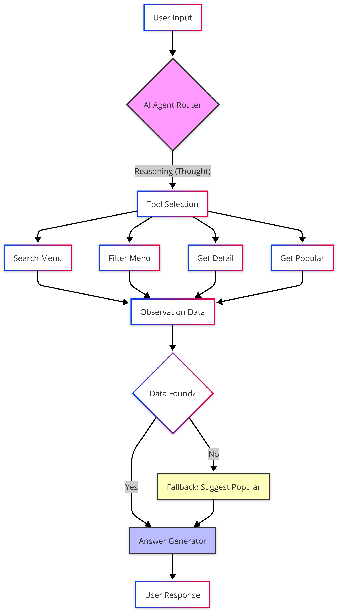

# Foodie Chatbot: Agentic RAG Restaurant Assistant

AI Agent สำหรับแนะนำเมนูอาหารตามสั่ง โดยใช้ **DeepSeek `deepseek-v4-pro`** เป็น LLM หลัก, ใช้ **LangGraph/LangChain** จัดการ agent workflow, มี **Memory**, **Prompt Context Layer**, **Tools**, **Hallucination Guard** และรันเป็นเว็บด้วย **Gradio + Docker Compose**

> เป้าหมายหลัก: หลังตั้งค่า `.env` แล้ว เปิดระบบได้ด้วยคำสั่งเดียว `docker compose up -d`

---

## Quick Start

### 1. เตรียมไฟล์ `.env`

สร้างไฟล์ `.env` ที่ root ของโปรเจกต์:

```env
DEEPSEEK_API_KEY=your_key_here
DEEPSEEK_BASE_URL=https://api.deepseek.com
DEEPSEEK_MODEL=deepseek-v4-pro
```

### 2. เปิดระบบด้วย Docker

```cmd
docker compose up -d
```

### 3. เข้าใช้งาน

เปิดเว็บ:

```text
http://localhost:7860
```

ตรวจสถานะ container:

```cmd
docker compose ps
```

ดู log:

```cmd
docker compose logs -f foodie-chatbot
```

ปิดระบบ:

```cmd
docker compose down
```

---

## Features

- **DeepSeek LLM**: ใช้ `deepseek-v4-pro` ผ่าน OpenAI-compatible API
- **Agentic RAG**: ผสม reasoning, tool calling และ retrieval เพื่อแนะนำเมนูตามเงื่อนไข
- **Conversation Memory**: ใช้ `ConversationBufferMemory` เพื่อจำบริบทสนทนาในแต่ละ session
- **Prompt Context Layer**: ใช้ `PromptTemplate` กำหนดบุคลิก กติกา และ context ของ AI
- **LangGraph Agent Workflow**: ใช้ `StateGraph` จัดลำดับ router, tool, answer และ guard
- **Hallucination Guard**: ตรวจคำตอบรอบสุดท้ายให้ยึดข้อมูลจาก tools ก่อนส่งให้ผู้ใช้
- **ChromaDB Vector Store**: ค้นหาเมนูเชิงความหมายด้วย local embedding
- **Auto Vector Store Setup**: สร้าง `vector_store` ให้อัตโนมัติตอนเปิดเว็บหรือ CLI
- **Gradio Web UI**: ใช้งานผ่านหน้าเว็บบน port `7860`
- **Docker Compose Runtime**: build และ run ทั้งระบบด้วยคำสั่งเดียว

---

## Architecture

```text
User
  |
  v
Gradio Web UI (app.py)
  |
  v
Foodie Agent (src/agent.py)
  |
  +--> ConversationBufferMemory
  |
  +--> PromptTemplate Context Layer
  |
  +--> LangGraph StateGraph
       |
       +--> Router Node
       +--> Tool Node
       |    +--> search_menu
       |    +--> filter_menu
       |    +--> get_dish_detail
       |    +--> get_menu_by_tag
       +--> Answer Node
       +--> Hallucination Guard Node
  |
  v
Final Answer
```

ภาพ workflow เดิม:

<div align="center">
  
</div>

---

## Project Structure

```text
foodie-chatbot/
├── app.py                  # Gradio Web UI สำหรับ Docker
├── run_agent.py            # CLI entry point สำหรับรันบนเครื่อง
├── Dockerfile              # Docker image definition
├── docker-compose.yml      # Compose runtime
├── requirements.txt        # Python dependencies
├── .dockerignore           # ไฟล์ที่ไม่ส่งเข้า Docker build context
├── .env                    # API key และ config ส่วนตัว
├── data/
│   └── menus.json          # ฐานข้อมูลเมนูอาหาร
├── images/
│   └── workflow.png        # ภาพ workflow
├── src/
│   ├── __init__.py
│   ├── agent.py            # LangGraph agent, memory, prompt, guard
│   ├── database.py         # โหลดข้อมูลเมนู
│   ├── llm.py              # DeepSeek client และ LLM helper
│   ├── retrieval.py        # ChromaDB + local embedding + query rewrite
│   └── tools.py            # Filter/detail/tag tools
└── vector_store/           # Persistent ChromaDB data
```

---

## Environment Variables

| Variable | Required | Default | Description |
|---|---:|---|---|
| `DEEPSEEK_API_KEY` | Yes | none | API key สำหรับ DeepSeek |
| `DEEPSEEK_BASE_URL` | No | `https://api.deepseek.com` | Base URL แบบ OpenAI-compatible |
| `DEEPSEEK_MODEL` | No | `deepseek-v4-pro` | โมเดลที่ใช้ตอบและวางแผน |
| `DEEPSEEK_TEMPERATURE` | No | `0.2` | ความสร้างสรรค์ของคำตอบ |
| `DEEPSEEK_TIMEOUT` | No | `60` | timeout ต่อ request เป็นวินาที |
| `GRADIO_SERVER_PORT` | No | `7860` | port ของเว็บ Gradio |

---

## Docker Usage

รันระบบ:

```cmd
docker compose up -d
```

Rebuild หลังแก้ dependency หรือ Dockerfile:

```cmd
docker compose up -d --build
```

ดู log:

```cmd
docker compose logs -f foodie-chatbot
```

หยุดระบบ:

```cmd
docker compose down
```

ข้อมูล vector store จะถูกเก็บผ่าน volume mapping:

```yaml
./vector_store:/app/vector_store
./data:/app/data:ro
```

เมื่อ clone โปรเจกต์ใหม่ ไม่ต้องรัน `retrieval.py` เองก่อน ระบบจะสร้าง `vector_store` ให้อัตโนมัติระหว่าง start container

---

## Local Development

ใช้เมื่ออยากรันบนเครื่องโดยไม่ผ่าน Docker

### 1. สร้าง virtual environment

```cmd
python -m venv .venv
```

### 2. ติดตั้ง dependencies

```cmd
.venv\Scripts\python.exe -m pip install -r requirements.txt
```

### 3. รัน Web UI

```cmd
.venv\Scripts\python.exe app.py
```

### 4. รัน CLI

```cmd
.venv\Scripts\python.exe run_agent.py
```

### 5. เตรียม vector store เองแบบ manual

ปกติไม่ต้องทำขั้นตอนนี้ เพราะ `app.py` และ `run_agent.py` จะเรียกเตรียม `vector_store` ให้อัตโนมัติแล้ว ใช้คำสั่งนี้เฉพาะกรณีต้องการ rebuild/ทดสอบด้วยตัวเอง:

```cmd
.venv\Scripts\python.exe -X utf8 -m src.retrieval
```

---

## Agent Tools

| Tool | Purpose |
|---|---|
| `search_menu(query, n_results)` | ค้นหาเมนูเชิงความหมายจากคำถาม |
| `filter_menu(...)` | กรองตามวัตถุดิบ ราคา ประเภท แคลอรี่ หรือสารก่อภูมิแพ้ |
| `get_dish_detail(dish_name)` | ดูรายละเอียดเมนูเฉพาะชื่อ |
| `get_menu_by_tag(tag)` | ดึงเมนูตามแท็ก เช่น `ยอดนิยม`, `สุขภาพ`, `เผ็ด` |

---

## Hallucination Guard

ระบบมี guard ก่อนส่งคำตอบสุดท้าย โดยให้ LLM ตรวจคำตอบเทียบกับหลักฐานจาก tools:

- ถ้าคำตอบมีเมนู ราคา แคลอรี่ หรือวัตถุดิบที่ไม่มีในหลักฐาน ระบบจะให้แก้คำตอบ
- ถ้าหลักฐานไม่พอ ระบบจะตอบว่าไม่พบข้อมูลชัดเจน
- คำตอบสุดท้ายยังคงน้ำเสียงเป็นกันเองแบบ "น้องหิวข้าว"

---

## Troubleshooting

### `ไม่พบ DEEPSEEK_API_KEY`

ตรวจว่าไฟล์ `.env` อยู่ที่ root ของโปรเจกต์ และมีบรรทัดนี้:

```env
DEEPSEEK_API_KEY=your_key_here
```

### เปิดเว็บไม่ได้

ตรวจ container:

```cmd
docker compose ps
```

ตรวจ log:

```cmd
docker compose logs -f foodie-chatbot
```

ถ้า port `7860` ถูกใช้แล้ว ให้แก้ port ใน `docker-compose.yml` เช่น:

```yaml
ports:
  - "7861:7860"
```

แล้วเข้าเว็บที่:

```text
http://localhost:7861
```

### แก้โค้ดแล้ว Docker ยังเป็นของเก่า

สั่ง rebuild:

```cmd
docker compose up -d --build
```

---

## Roadmap

- [x] DeepSeek `deepseek-v4-pro`
- [x] Memory ด้วย `ConversationBufferMemory`
- [x] Context Layer ด้วย `PromptTemplate`
- [x] Agent workflow ด้วย LangGraph `StateGraph`
- [x] Hallucination Guard
- [x] Gradio Web UI
- [x] Docker Compose runtime
- [ ] Voice Order ด้วย Speech-to-Text
- [ ] Persistent multi-user chat history
- [ ] Admin page สำหรับเพิ่ม/แก้ไขเมนู

---

## Team Members

- https://github.com/miyomui
- https://github.com/techindetc-ux
- https://github.com/Ploy-ari
- https://github.com/ffourwheel

---

Created for Advanced Agentic AI Course
